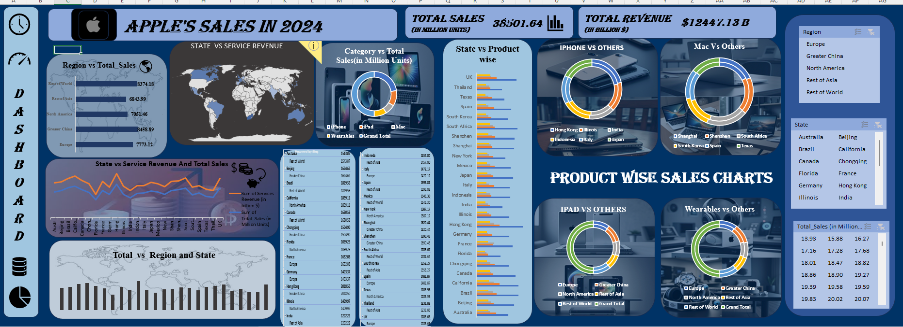

# Apple company sales 2024
📌 Overview
This project features an interactive Excel dashboard analyzing Apple Inc.'s 2024 sales data. The dashboard provides insights into product 
performance, regional sales trends, revenue breakdowns, and customer segments using Excel’s built-in tools like PivotTables, charts, slicers, 
and conditional formatting. 

📂 Project Details: 

    📊 File Format: Excel (.xlsx)
    🗂️ Dataset Source: Kaggle
    📅 Year Covered: 2024
    ⚙️ Tools Used:
        PivotTables & PivotCharts
        Excel Formulas & Functions
        Data Validation & Slicers
        Conditional Formatting

📈 Dashboard Features: 
    ✔ Total Sales Summary – Key financial metrics in a dynamic layout.
    ✔ Top-Selling Products – Breakdown of the best-performing Apple products.
    ✔ Regional Performance – Sales distribution across different geographic regions.

🖥️ How to Use:
    1. Open the Excel file in Microsoft Excel (2016 or later for full functionality).
    2. Interact with slicers to filter data by state, region, or sales.
    3. Hover over charts to view detailed insights.
    4. Modify the dataset in the raw data sheet to update the dashboard dynamically.

📊 Preview of the Dashboard

⚠ Notes
    This dashboard was created using Excel only, without Power Query or external tools.

📜 License & Attribution
    Dataset source: Kaggle
    Free for educational and analytical use.